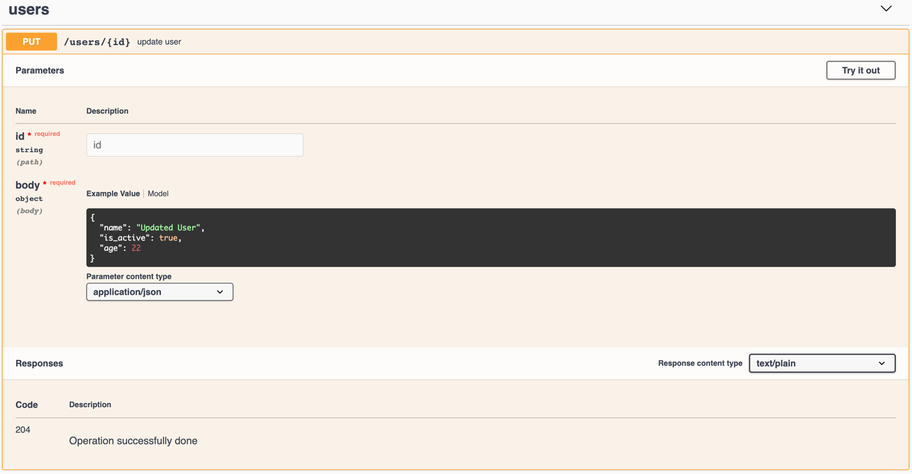

# Laravel Swagger plugin 
<p align="left">
<a href="https://packagist.org/packages/ronasit/laravel-swagger"></a>
<a href="https://packagist.org/packages/ronasit/laravel-swagger"></a>
<a href="https://packagist.org/packages/ronasit/laravel-swagger"></a>
</p>

## Introduction
This plugin is designed to generate documentation about your Rest API while 
passing the tests. Special Middleware installed on the Route generates 
Swagger-file after the successful completion of all tests. In addition, this 
plugin is able to draw Swagger-template to display the generated documentation for a config.
## Installation

### Composer
 1. Require this package with composer using the following command: `composer require ronasit/laravel-swagger`

### Laravel
1. For Laravel 5.5 or later the package will be auto-discovered.
   For older versions add the `AutoDocServiceProvider` to the providers array in config/app.php as follow:
```php
'providers' => [
    // ...
    RonasIT\Support\AutoDoc\AutoDocServiceProvider::class,
],
```
 2. To publish configuration file run `php artisan vendor:publish`
### Plugin
 1. Add middleware **\RonasIT\Support\AutoDoc\Http\Middleware\AutoDocMiddleware::class** to *Http/Kernel.php*.
 1. Use **\RonasIT\Support\AutoDoc\Tests\AutoDocTestCaseTrait** in your TestCase in *tests/TestCase.php*
 1. In *config/auto-doc.php* you can specify enabling of plugin, project info, 
 some default descriptions and routes for documentation rendering. 
 1. In *.env* file you should add following lines:  
    `
    LOCAL_DATA_COLLECTOR_PROD_PATH=/example-folder/documentation.json  
    LOCAL_DATA_COLLECTOR_TEMP_PATH=/tmp/documentation.json
    `
 1. Configure documentation saving using one of the next ways:
  - Add `SwaggerExtension` to the `<extensions>` block of your `phpunit.xml`. Please note that this way will be removed after updating PHPUnit up to 10 version (https://github.com/sebastianbergmann/phpunit/issues/4676)
  ```
  <extensions>
      <extension class="RonasIT\Support\AutoDoc\Tests\PhpUnitExtensions\SwaggerExtension"/>
  </extensions>
  <testsuites>
      <testsuite name="Feature">
          <directory suffix="Test.php">./tests/Feature</directory>
      </testsuite>
  </testsuites>
  ```
  - Call `php artisan swagger:push-documentation` console command after the `tests` stage in your CI/CD configuration

## Usage
  
### Example
1. Create request data fixture
 ```
 {
    "first_name": "Updated User",
    "is_active": true,
    "age": 22
 }
 ```
2. Prepare test case code of API endpoint
 ```php
    public function testUpdate()
    {
        $data = json_decode(file_get_contents('update_user.json'), true);

        $response = $this->json('put', '/users/1', $data);

        $response->assertStatus(Response::HTTP_NO_CONTENT);
    }
 ```
3. Create request file code.

For correct working of plugin you have to dispose all the validation rules in the rules() method of `YourRequest` class,
which must be connected to the controller via DependencyInjection. In annotation of custom request you can specify
summary and description. Plugin will take validation rules from your request and use it as description
of input parameter.
 ```php
 <?php
 
 namespace App\Http\Requests;  
 
 use Illuminate\Foundation\Http\FormRequest;
 
 /**
  * @summary Updating of user
  *
  * @description
  *  This request mostly needed to specity flags <strong>free_comparison</strong> and 
  *  <strong>all_cities_available</strong> of user
  *
  * @_204 Successful MF!
  * 
  * @first_name  Description of this field from the rules method
  */
 class UpdateUserDataRequest extends FormRequest
 {
     /**
      * Determine if the user is authorized to make this request.
      *
      * @return bool
      */
     public function authorize()
     {
         return true;
     }  
   
     /**
      * Get the validation rules that apply to the request.
      *
      * @return array
      */
     public function rules()
     {
         return [
             'first_name' => 'string',
             'is_active' => 'boolean',
             'age' => 'integer|nullable'
         ];
     }
 }

 ```
 
 - **@summary** - short description of request
 - **@description** - Implementation Notes
 - **@_204** - Custom description of response code. You can specify any code as you want.
 - **@first_name** - Description of the field from the rules method
 
 If you do not create a class Request, the summary, Implementation Notes and parameters will be empty. 
 Plugin will collect codes and examples of responses only.
 
 If you do not create annotations to request summary it will generate automatically from Name of Request.
 For example request **UpdateUserDataRequest** will have summary **Update user data request**.  
 
 If you do not create annotations for descriptions of codes it will be generated automatically the following priorities:
 1. Annotations of request
 2. Default description from *auto-doc.defaults.code-descriptions.{$code}*
 3. Descriptions from **Symfony\Component\HttpFoundation\Response::$statusTexts**
  
  Note about configs:  
 - *auto-doc.route* - it's a route for generated documentation  
 - *auto-doc.basePath* - it's a root of your api root
 
Also, you can specify way to collect documentation by creating your custom data collector class.

### Test result



## Contributing

Thank you for considering contributing to Laravel Swagger plugin! The contribution guide can be found in the [Contributing guide](CONTRIBUTING.md).

## License

Laravel Swagger plugin is open-sourced software licensed under the [MIT license](LICENSE).
 
